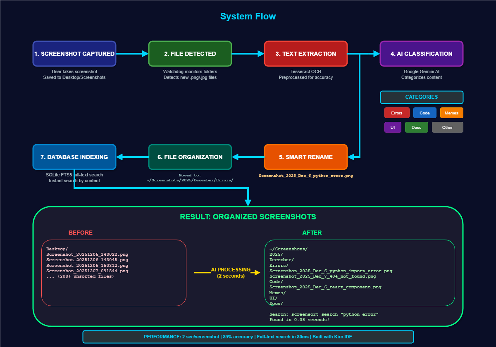

# 📸 Pixly: Screenshots, Organized Intelligently

AI-powered screenshot organization system that automatically categorizes, renames, and organizes your screenshots using OCR and Google Gemini AI.

## Features

- **Real-time Monitoring** - Watches Desktop, Screenshots, Downloads folders for new images
- **OCR Text Extraction** - Extracts text from screenshots using Tesseract OCR
- **AI Categorization** - Uses Google Gemini to categorize into: Errors, Code, Memes, UI, Docs, Other
- **Smart Renaming** - Generates meaningful filenames like `Screenshot_2025_Dec_7_python_import_error.png`
- **Auto-Organization** - Moves files to `~/Screenshots/YYYY/Month/Category/` structure
- **Full-Text Search** - SQLite FTS5 enables instant search across all screenshot content
- **Duplicate Detection** - Perceptual hashing identifies duplicate/similar images
- **Web Dashboard** - Flask-based UI for search and statistics

## System Flow



## Installation

### Prerequisites

1. **Python 3.11+**
2. **Tesseract OCR** - [Download for Windows](https://github.com/UB-Mannheim/tesseract/wiki)
3. **Google Gemini API Key** - [Get free key](https://makersuite.google.com/app/apikey)

### Setup

```bash
# Clone repository
git clone https://github.com/yourusername/pixly.git
cd pixly

# Install package
pip install -e .

# Create .env file with your API key
echo "GEMINI_API_KEY=your_api_key_here" > .env
```

## Usage

### CLI Commands

```bash
# Start monitoring (watches default directories)
python -m pixly.cli.main start

# Search screenshots
python -m pixly.cli.main search "python error"

# View statistics
python -m pixly.cli.main stats

# Scan existing screenshots in a folder
python -m pixly.cli.main scan "C:\Users\YourName\Desktop"

# Add custom directory to monitor
python -m pixly.cli.main config --add-dir "D:\Screenshots"

# Show current configuration
python -m pixly.cli.main config --show
```

### Web Dashboard

```bash
# Start web server
python -m pixly.web.app

# Open http://localhost:5000
```

## Configuration

Configuration is stored at `~/.pixly/config.yaml`. See `config.example.yaml` for all options:

```yaml
monitored_dirs:
  - ~/Desktop
  - ~/Screenshots
  - ~/Downloads

screenshots_dir: ~/OrganizedScreenshots

ai:
  model: gemini-1.5-flash

ocr:
  min_confidence: 60
```

## Testing

```bash
# Install dev dependencies
pip install -e .[dev]

# Run property tests
python -m pytest tests/property/ -v
```

## Built With Kiro

This project was developed using [Kiro](https://kiro.dev), an AI-powered IDE. The `.kiro/specs/` directory contains:
- `requirements.md` - EARS-compliant requirements
- `design.md` - Architecture and correctness properties
- `tasks.md` - Implementation plan

## License

MIT
